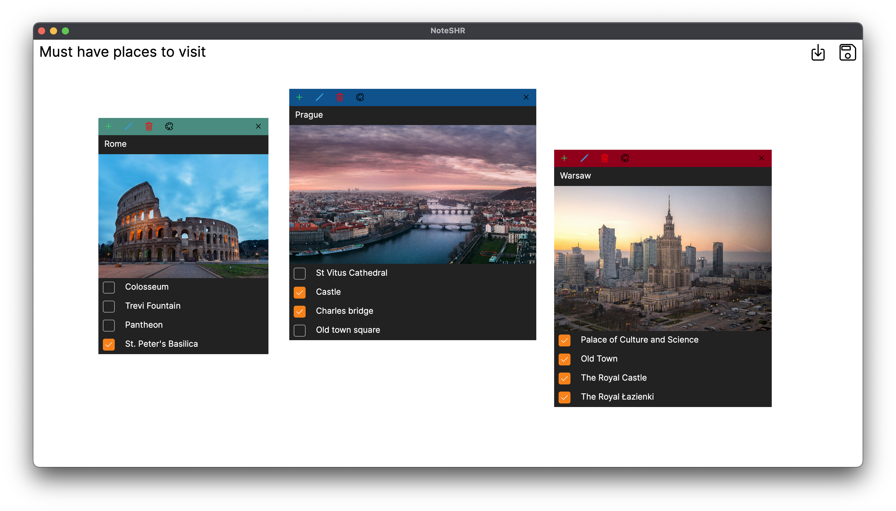

# NoteSHR

<div style="margin-bottom: 0.5rem;">
    
</div>

A multi-platform application to effectively manage notes on a whiteboard.

## Goals

For more detailed plan of app development please look into [TODO board](https://dolczyk.notion.site/TODO-68c8d6e46fbe4519b3fb762d7469b6e6?pvs=4)

- [x]  Proof of concept
- [ ]  Save file scheme
- [ ]  Beautify app
- [ ]  Share board with everyone
- [ ]  Collaboration API
- [ ]  Keep responsiveness and stability for web, desktop and mobile platforms

## Try it out

* [Web version](https://note-shr.dolczyk.rocks)
* Desktop platforms (Windows, MacOS, Linux). Pick the latest build action from [here](https://github.com/MRmlik12/note-shr/actions/workflows/build.yml)

## Build/Run process

To run this project you must install .NET 8 with workloads such as `android` , `iOS` and `wasm-tools`

### Install dependencies

```bash
$ dotnet restore
# Install workloads
$ dotnet workload install android
$ dotnet workload install iOS
$ dotnet workload install wasm-to
```

### Run project

```bash
# Run a Desktop platform 
$ dotnet run --project src/NoteSHR.Desktop
# For iOS platform
$ dotnet run --project src/NoteSHR.iOS
# For Android platform
$ dotnet run --project src/NoteSHR.Android
# For Web platform
$ dotnet run --project src/NoteSHR.Browser
```

### Build

#### Using Bash

```bash
# For desktop platforms
$ ./build.sh --configuration Release
# For iOS platform
$ ./build.sh --configuration Release --allow-ios-build
# For Android platform
$ ./build.sh --configuration Release --allow-android-build
```

#### Using PowerShell

```powershell
# For desktop platforms 
> .\build.ps1 
# For iOS platform
> .\build.ps1 --allow-ios-build
# For Android platform
> .\build.ps1 --allow-android-build
```

## Used libraries

- [Avalonia](https://avaloniaui.net/)
- [ReactiveUI](https://www.reactiveui.net/)
- [NUKE](https://nuke.build/)